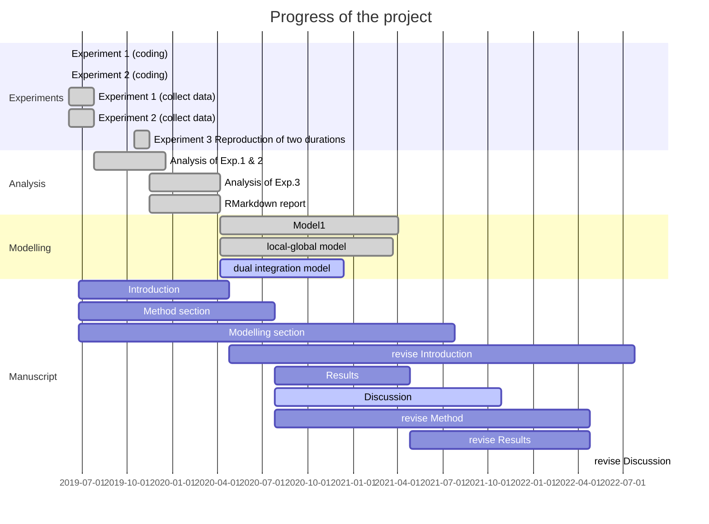

---
output:
  pdf_document: default
  html_document: default
---
# RP_GlobalPrior

Global Prior in duration reproduction task 

## Progress

## To-do tasks

1. [x] Experiments1
     1. [x] coding and debugging
     2. [x] collecting data
2. [x] Experiments2
     1. [x] coding and debugging
     2. [x] collecting data (2 data more)
3. [x] Modelling
     1. [x] code
     2. [x] simulation
4. [x] Data Analysis
    1. [x] Preliminary analysis
    2. [x] anova 
    3. [x] Generate a report
    4. [x] analysis for Exp. 1 and 3
    5. [x] writing result part
    6. [x] writing discussion
5. [x] presentation of the results
6. [ ] revise manuscript

## Description

### Experiment 1: 
In this experiment, the short and long ranges were clearly separate. We adopted the left and right spatial separation for the short and long ranges, as used in Roach et al. (2017).
In this experiment 2, the target intervals are the ramdomly selected elements fromthree groups of time intervals groups: the short (400-800ms), long (1200-1600ms), and the mixed group(400-800ms, 1200-1600ms).

- short group:0.4000    0.4757    0.5657    0.6727    0.8000
- long group: 1.2000    1.4270    1.6971    2.0182    2.4000
- mixed group: 0.4000    0.4757    0.5657    0.6727    0.8000
  1.2000    1.4270    1.6971    2.0182    2.4000
  
feedback: 1-5, respect to the reproduction error

480 trials  takes 65 mins

__Summary of the manipulated factors__

1. condition:   1 = short group; 2 = long group; 3= mixed group
2. stimulus set: 1 to 10

__Experimental program__: code/main_gp_ss_loc.m 

__Table head of Data (.csv files)__: 
  
  | index | table head | comments                                   |
  |-------|------------|--------------------------------------------|
  | 1     | group      | group type: 1 = short; 2 = long; 3= mixed  |
  | 2     | Set        | stimulus sets: 1:10                         |
  | 3     | targetDur       | target duration                        |
  | 4     | phyTargetDur      | physical target duration             |
  | 5     | RP       | reproduced duration                       |
  | 6     | NSub       | subject ID                    |
  | 7     | NT        | trial number                   |  
  | 8    | valid        | valid                    |                      
  | 9    | Exp       | experiment version          |
  | 10    | NB       | Block number                |

__Report__: Report.Rmd

### Experiment 2: 

In this experiment, the short and long ranges were clearly separate. We adopted the left and right spatial separation for the short and long ranges, as used in Roach et al. (2017).

In this experiment 1, the target intervals are the ramdomly selected elements from the following groups:  short group (491.2-732.8ms), long group (1310-1954ms), and mixed group

- short group: 0.4912    0.5429    0.6000    0.6631    0.7328 
- long group: 1.3100    1.4478    1.6001    1.7683    1.9543
- mixed group: 0.4912    0.5429    0.6000    0.6631    0.7328 
  1.3100    1.4478    1.6001    1.7683    1.9543

feedback: 1-5, respect to the reproduction error

480 trials  takes 65 mins

__Summary of the manipulated factors__

1. condition:   1 = short group; 2 = long group; 3= mixed group
2. stimulus set: 1 to 10

__Experimental program__: code/main_gp_loc.m 

__Table head of Data (.csv files)__: 
  
  | index | table head | comments                                   |
  |-------|------------|--------------------------------------------|
  | 1     | group      | group type: 1 = short; 2 = long; 3= mixed  |
  | 2     | Set        | stimulus sets: 1:10                         |
  | 3     | targetDur       | target duration                        |
  | 4     | phyTargetDur      | physical target duration                        |
  | 5     | RP       | reproduced duration                       |
  | 6     | NSub       | subject ID                    |
  | 7     | NT        | trial number                   |  
  | 8    | valid        | valid                   |                      
  | 9    | Exp       | experiment version                  |
  | 10    | NB       | Block number                 |
  
__Report__: Report.Rmd

__Model Version__: ModelReportV(X).Rmd

__Model Description__:

* Model Baseline:models to estimate parameters for short and long groups, and prediction of the RP.
    + Baseline(ModelReportBaseline.Rmd):
       Y_s[i] ~ normal(a_s + b_s * X_s[i], p_wf *X_s[i]); //short groups
       Y_l[j] ~ normal(a_l + b_l * X_l[j], X_l[j]*p_wf); //long groups
      
    + Baseline2 (ModelReportBaseline2.Rmd):
      mu_s ~ normal(xmean[1], p_wf^2 * xmean[1]^2);  // mean prior of short group 
      mu_l ~ normal(xmean[2], p_wf^2 * xmean[2]^2);   // mean prior of long group
      real<lower=0> p_wf;   //Weber Fraction of local prior
      real<lower=0> wf;     //Weber Fraction of sensory noise

    + Baseline3 (ModelReportBaseline3.Rmd):
    
      mu_s ~ normal(xmean[1], p_wf^2 * xmean[1]^2);  // mean prior of short group 
      mu_l ~ normal(xmean[2], p_wf^2 * xmean[2]^2);   // mean prior of long group
      real<lower=0> p_wf_s;   //Weber Fraction of local prior
      real<lower=0> wf_s;     //Weber Fraction of sensory noise
      real<lower=0> p_wf_l;   //Weber Fraction of local prior
      real<lower=0> wf_l;     //Weber Fraction of sensory noise
          
* Model: models to estimate parameters for mix groups, and prediction of the RP.
   + V1: (ModelReport.Rmd) 
   
	  -- H1: prior short and prior long works independent
 
   + V2:  (ModelReportV2.Rmd) 
   
	  -- H2:  A hierarchical local-global model
	  
	  -- H3: Global prior (the dual integration model)
  
